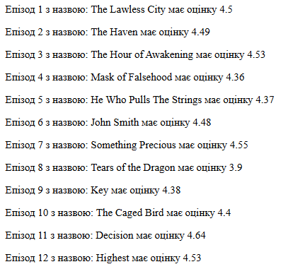
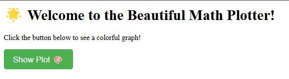
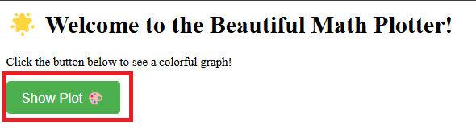
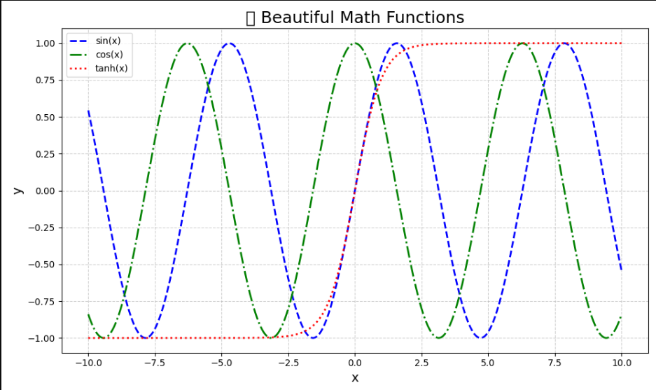

# Звіт до роботи 4

### Тема: _Віртуальні середовища_

### Мета роботи: _Ознайомитися з ізольованими середовищами у Python, встановленням та використанням сторонніх бібліотек, а також інструментами керування залежностями_
---------------------------------------------------------------
Ізольовані віртуальні середовища - це сукупність Python інтерпретатора, бібліотек та скриптів ізольована від інших інсталяцій. Віртуальні середовища в Python дозволяють створювати ізольовані простори для проєктів, забезпечуючи незалежність від глобальних налаштувань та залежностей. Це особливо корисно при роботі з різними проєктами, які можуть вимагати різних версій бібліотек.

### **1. Основи роботи з сторонніми бібліотеками**
**1. Для роботи з сторонніми бібліотеками їх потрібно спочатку встановити. Для їх встановлення є інструмент PIP (Python Install Package). Перевірила чи він встановлений на компютері:**

```bash
pip -V
pip --help
```
 **2. Передивилась які дії можна зробити за допомогою pip. Перевірила які бібліотеки вже інстальовані на моєму компютері та вказала їх у звіті.**
#### Commands:
- **install** - Install packages.
- **download** - Download packages.
- **uninstall** - Uninstall packages.
- **freeze** - Output installed packages in requirements format.     
- **inspect** - Inspect the python environment.
- **list** - List installed packages. 
- **show** -  Show information about installed packages.   
- **check** - Verify installed packages have compatible dependencies.
- **config** - Manage local and global configuration.
- **search** - Search PyPI for packages.
- **cache** - Inspect and manage pip's wheel cache.
- **index** - Inspect information available from package indexes.
- **wheel** - Build wheels from your requirements.
- **hash** -  Compute hashes of package archives.
- **completion** - A helper command used for command completion.
- **debug** -  Show information useful for debugging.
- **help** -  Show help for commands.

 #### Інстальовані бібліотеки:
 
- **pip 24.3.1** - Менеджер пакетів Python.
- **setuptools 75.8.0** -	Будування і встановлення пакетів.
- **requests 2.32.3** -	Робота з HTTP-запитами.
- **httpx	0.28.1** - Асинхронні HTTP-запити.
- **numpy	2.2.2** -	Наукові обчислення.
- **ipykernel 6.29.5** - Підтримка Jupyter.
- **ipython	8.31.0** - Інтерактивне середовище Python.
- **jupyter_client 8.6.3** - Комунікація клієнта Jupyter.
- **jupyter_core 5.7.2** - Базові функції Jupyter.
- **traitlets 5.14.3** - Налаштування Python-об'єктів (важливо для Jupyter).
- **matplotlib-inline 0.1.7** - Графіки в Jupyter.
- **urllib3	2.3.0**	- Робота з HTTP-з'єднаннями.
- **cachecontrol 0.14.2** - Кешування запитів.
- **build 1.2.2.post1** - Будування Python-пакетів.
- **virtualenv 20.29.1** - Створення віртуальних середовищ.
- **filelock 3.17.0** -	Блокування файлів (важливо для безпечного встановлення).
- **packaging 24.2** - Робота із версіями та залежностями.

**3. Будь-яку сторонню бібліотеку можна встановити на комп'ютер за допомогою pip install команди та зразу почати її використовувати, наприклад встановимо бібліотеку requests:**
- Після чого встановила першу сторонню бібліотеку requests:
```bash
pip install requests
```
- Та опробовуєм її в пайтон інтерпретаторі
```python
import requests
r = requests.get('https://google.com')
print (f"Повернув статус:{r.status_code}")
```

**4. Вставила у звіт результат виконання команд**

```python
Повернув статус:200
```

**5. Ознайомилась які ще методи є в бібліотеці requests:**

- **requests.get(url, ...)** - Надіслати GET-запит — отримати дані з сервера.
- **requests.post(url, data=..., json=..., ...)** - Надіслати POST-запит — передати дані на сервер.
- **requests.put(url, data=..., ...)** - Надіслати PUT-запит — оновити існуючі дані на сервері.
- **requests.delete(url, ...)** - Надіслати DELETE-запит — видалити - ресурс на сервері.
- **requests.head(url, ...)** - Отримати заголовки відповіді без тіла відповіді.
- **requests.options(url, ...)** - Дізнатися, які методи дозволені на сервері.
- **requests.patch(url, data=..., ...)** - Надіслати PATCH-запит — часткове оновлення даних.

#### **Приклад простого запиту:**
```python
import requests
r = requests.get('https://google.com')
print (f"Повернув статус:{r.status_code}")
```
**6. Даний спосіб інсталяції робить бібліотеку загальнодоступною для даної системи. Будь-яке оновлення бібліотеки буде застосоване до всіх Python проектів на Вашому комп'ютері**
```bash
pip show requests
pip install requests==2.1
pip show requests
pip uninstall requests
```
**7. Вказала у звіті результати виконання команд.Так як версія requests==2.1 застаріла, то я використовувала equests==2.26.**
```bash
$ pip show requests
Name: requests
Version: 2.32.3
Summary: Python HTTP for Humans.
Home-page: https://requests.readthedocs.io
Author: Kenneth Reitz
Author-email: me@kennethreitz.org
License: Apache-2.0
Location: C:\python\Lib\site-packages
Requires: certifi, charset-normalizer, idna, urllib3
Required-by: CacheControl, poetry, requests-toolbelt
```
```bash
$ pip install "requests>=2.26"
Collecting requests>=2.26
  Using cached requests-2.32.3-py3-none-any.whl.metadata (4.6 kB)
Requirement already satisfied: charset-normalizer<4,>=2 in c:\python\lib\site-packages (from requests>=2.26) (3.4.1)
Requirement already satisfied: idna<4,>=2.5 in c:\python\lib\site-packages (from requests>=2.26) (3.10)
$ pip install "requests>=2.26"
Collecting requests>=2.26
  Using cached requests-2.32.3-py3-none-any.whl.metadata (4.6 kB)
Requirement already satisfied: charset-normalizer<4,>=2 in c:\python\lib\site-packages (from requests>=2.26) (3.4.1)
Requirement already satisfied: idna<4,>=2.5 in c:\python\lib\site-packages (from requests>=2.26) (3.10)
  Using cached requests-2.32.3-py3-none-any.whl.metadata (4.6 kB)
Requirement already satisfied: charset-normalizer<4,>=2 in c:\python\lib\site-packages (from requests>=2.26) (3.4.1)
Requirement already satisfied: idna<4,>=2.5 in c:\python\lib\site-packages (from requests>=2.26) (3.10)
Requirement already satisfied: idna<4,>=2.5 in c:\python\lib\site-packages (from requests>=2.26) (3.10)
Requirement already satisfied: urllib3<3,>=1.21.1 in c:\python\lib\site-packages (from requests>=2.26) (2.3.0)
Requirement already satisfied: certifi>=2017.4.17 in c:\python\lib\site-packages (from requests>=2.26) (2025.1.31)
Using cached requests-2.32.3-py3-none-any.whl (64 kB)
Installing collected packages: requests
Requirement already satisfied: urllib3<3,>=1.21.1 in c:\python\lib\site-packages (from requests>=2.26) (2.3.0)
Requirement already satisfied: certifi>=2017.4.17 in c:\python\lib\site-packages (from requests>=2.26) (2025.1.31)
Using cached requests-2.32.3-py3-none-any.whl (64 kB)
Installing collected packages: requests
Using cached requests-2.32.3-py3-none-any.whl (64 kB)
Installing collected packages: requests
  Attempting uninstall: requests
    Found existing installation: requests 2.1.0
    Uninstalling requests-2.1.0:
  Attempting uninstall: requests
    Found existing installation: requests 2.1.0
    Uninstalling requests-2.1.0:
    Uninstalling requests-2.1.0:
      Successfully uninstalled requests-2.1.0
Successfully installed requests-2.32.3

[notice] A new release of pip is available: 24.3.1 -> 25.0.1
[notice] To update, run: python.exe -m pip install --upgrade pip
```
```bash
$ pip show requests
Name: requests
Version: 2.32.3
Summary: Python HTTP for Humans.
Home-page: https://requests.readthedocs.io
Author: Kenneth Reitz
Author-email: me@kennethreitz.org
License: Apache-2.0
Location: C:\python\Lib\site-packages
Requires: certifi, charset-normalizer, idna, urllib3
Required-by: CacheControl, poetry, requests-toolbelt
```
```bash
$ pip uninstall requests
Found existing installation: requests 2.32.3
Uninstalling requests-2.32.3:
  Would remove:
    c:\python\lib\site-packages\requests-2.32.3.dist-info\*
    c:\python\lib\site-packages\requests\*
Proceed (Y/n)? y
  Successfully uninstalled requests-2.32.3
```

**8. Для любителів Аніме, можна поекспериментувати з бібліотекою jikanpy яка є АПІ для роботи з Аніме сайтом.**

 1. Встановлюємо бібліотеку jikanpy:
 ```bash
 $  pip install jikanpy-v4
 ```
 2. Після цього ми запускаємо цю [ `програму`](anime.py), нам видає  посилання на сервер http://127.0.0.1:5000/, результат можна подивитись на зображенні:

```python
* Serving Flask app 'anime'
 * Debug mode: on
WARNING: This is a development server. Do not use it in a production deployment. Use a production WSGI server instead.
 * Running on http://127.0.0.1:5000
Press CTRL+C to quit
 * Restarting with stat
 * Running on http://127.0.0.1:5000
Press CTRL+C to quit
 * Restarting with stat
 * Debugger is active!
 * Debugger PIN: 598-531-808
 ```


### Робота у віртуальному середовищі
1. **[Віртуальні середовища в Python](https://docs.python.org/3/library/venv.html)** - це ізольовані середовища для роботи з 'замороженою' версією Python та його бібліотек. Середовище створюється для кожного проекту окремо і буде мати ті самі характеристики в не залежності де та на якій системі буде запущено;

2. Для створення VENV та його активації виконала команди:
```
python -m venv ./my_env
source my_env/Scripts/activate
pip install requests
deactivate
pip show requests
```
3. Остання команда pip show requests вивела детальну інформацію про пакет requests, тому що команда pip show використовується для виведення метаданих про конкретний встановлений пакет. У цьому випадку виводиться інформація, яка описує бібліотеку requests, зокрема її версію, залежності, місце встановлення та інші метадані.

   Команда була використана для того, щоб перевірити, яка версія бібліотеки requests встановлена на вашому комп'ютері, а також додаткову інформацію про неї, що може бути корисною при роботі з цією бібліотекою.
```bash
$  pip show requests
Name: requests
Version: 2.32.3
Summary: Python HTTP for Humans.
Home-page: https://requests.readthedocs.io
Author: Kenneth Reitz
Author-email: me@kennethreitz.org
License: Apache-2.0
Location: C:\python\Lib\site-packages
Requires: certifi, charset-normalizer, idna, urllib3
Required-by: CacheControl, jikanpy-v4, poetry, requests-toolbelt
``` 
4. Всі створені файли не потрібно комітити в репозиторій. Щоб уникнути такого автоматично потрібно створити файл **.gitignore** у кореневій папці та вказати в ньому папки які потрібно ігнорувати.
```
.my_env/
.ven/
``` 
### **2. Робота з Pipenv**
- Потрібно встановити pipenv.

```bash
pip install pipenv
``` 
- Довідка про команди pipenv.

```bash
pipenv --help
```

### **Ось які команди можна виконувати за допомогою Pipenv:**
1. **pipenv install** – installs all dependencies listed in the Pipfile, or a specific package if its name is provided.
2. **pipenv uninstall** – removes the specified package or all dependencies if no package is specified.
3. **pipenv shell** – launches an interactive shell with the virtual environment activated.
4. **pipenv lock** – creates or updates the Pipfile.lock, which contains the exact versions of installed dependencies.
5. **pipenv graph** – displays the dependency graph for the project.
6. **pipenv check** – checks for vulnerabilities in the installed dependencies.
7. **pipenv --venv** – shows the path to the virtual environment associated with the project.
8. **pipenv --rm** – removes the virtual environment associated with the current project.
9. **pipenv install --dev** – installs development dependencies listed in the dev-packages section of the Pipfile.
10. **pipenv update** – updates all dependencies to the latest available versions according to the version rules in the Pipfile.

### **Для створення нового середовища та інсталяції бібліотек виконайте наступні команди:**
```
pipenv --python 3.10
pipenv --venv
pipenv run python -V
pipenv install requests
```
### **Після виконання створюються два файли [Pipfile](pipenv_env/Pipfile) та [ Pipfile.lock.](pipenv_env/Pipfile.lock)**

- **Pipfile** — містить інформацію про Python-версію та залежності.
- **Pipfile.lock** — фіксує точні версії залежностей.

### **Створили пайтон файл та записали в нього наступну [програму](pipenv_env/test.py):**

```python 
import requests

response = requests.get('https://httpbin.org/')
for line in response.iter_lines():
    print(line)
```
- Щоб запустити програму за допомогою командної стрічки, спочатку потрібно активувати середовище за допомоги цієї команди:
```
pipenv shell
```

- Після запустити саму програму за допомоги команди:
```
pipenv run python "назва прогрми"
```
- нам видасть html код та посилання https://github.com/postmanlabs/httpbin .

### **Вибрала бібліотеку Pypi та спробувала виконати приклади. Документацію цієї бібліотеки можна знайти [тут](https://pypi.org/) .**

```python 
import pyfiglet

text = "Hello, World!"
ascii_art = pyfiglet.figlet_format(text)
print(ascii_art)
```
- результат програми 
```
Loading .env environment variables...
Loading .env environment variables...
 _   _      _ _         __        __         _     _ _
| | | | ___| | | ___    \ \      / /__  _ __| | __| | |
| | | | ___| | | ___    \ \      / /__  _ __| | __| | |
| |_| |/ _ \ | |/ _ \    \ \ /\ / / _ \| '__| |/ _` | |
|  _  |  __/ | | (_) |    \ V  V / (_) | |  | | (_| |_|
|_| |_|\___|_|_|\___( )    \_/\_/ \___/|_|  |_|\__,_(_)
                    |/
```
- Visual Studio дозволяє змінити Python інтерпретатор для запуску через кнопку Run (трикутник ▶️). Для цього потрібно викликати командну палітру з меню View -> Command Palette... та в ній наберіть Python: Select interpreter. Після чого Visual Studio відобразить всі доступні інтерпретатори.

### **4. Робота зі змінними середовища**
1. Середовища також можна параметризувати за допомогою змінних середовища (Environment Variables). Для цього у папці повинен буди файл .env із заданими змінними у форматі KEY=VALUE. Pipenv автоматично розпізнає ці файли та робить їх доступними всередині середовища. Створіть файл .env та виконайте наступний код:
```py
import os
os.environ['HELLO']
```
- Якщо запустити скрипт через Pipenv то: Pipenv автоматично зчитує .env файл додає змінні в os.environ і os.environ['HELLO'] успішно поверне "world". Якщо запустити скрипт без активації середовища, то в такому разі змінна HELLO не буде доступною, і ти отримаєш: KeyError: 'HELLO', Тому що .env не зчитується автоматично стандартним інтерпретатором Python — тільки Pipenv робить це "з коробки"
```powershell
Loading .env environment variables...
Traceback (most recent call last):
  File "C:\projects OP\2024_kn240_oop_krasuliak_angelina_\1_lab\pipenv_env\import.py", line 2, in <module>
    os.environ['HELLO']
    ~~~~~~~~~~^^^^^^^^^
  File "<frozen os>", line 716, in __getitem__
KeyError: 'HELLO'
```

### **5. Робота з Poetry**

1. **poetry** — це сучасний інструмент для керування залежностями та пакетами в Python, який автоматично створює та керує віртуальними середовищами у проєктах.
2. Щоб створити новий проєкт, використовуйте команду:
```
poetry new myproject
```
або якщо у вас вже є проєкт, ініціалізуйте poetry в його директорії:
```
cd myproject
poetry init
```
3. Для встановлення пакетів Python, наприклад, requests, потрібно виконати:
```py
poetry add requests
# Це додасть бібліотеку до файлу `pyproject.toml` та встановить її у віртуальне середовище.
```
```
$ poetry add requests
The following packages are already present in the pyproject.toml and will be skipped:

  - requests

If you want to update it to the latest compatible version, you can use `poetry update package`.
If you prefer to upgrade it to the latest available version, you can use `poetry add package@latest`.

Nothing to add.
```
4. Щоб побачити список усіх встановлених залежностей у вашому проєкті, виконайте:
```
poetry show
```
```
$ poetry show
certifi            2025.1.31 Python package for providing Mozilla's CA Bundle.
charset-normalizer 3.4.1     The Real First Universal Charset Detector. Open, modern and actively maintained alternative to Chardet.
flake8             7.1.2     the modular source code checker: pep8 pyflakes and co
idna               3.10      Internationalized Domain Names in Applications (IDNA)
mccabe             0.7.0     McCabe checker, plugin for flake8
pycodestyle        2.12.1    Python style guide checker
pyflakes           3.2.0     passive checker of Python programs
requests           2.32.3    Python HTTP for Humans.
urllib3            2.3.0     HTTP library with thread-safe connection pooling, file post, and more.
```
5. Для детального перегляду залежностей з їхніми версіями та описами використовуйте:
```
poetry show --tree
```
```
$ poetry show --tree
flake8 7.1.2 the modular source code checker: pep8 pyflakes and co
├── mccabe >=0.7.0,<0.8.0
├── pycodestyle >=2.12.0,<2.13.0
└── pyflakes >=3.2.0,<3.3.0
requests 2.32.3 Python HTTP for Humans.
├── certifi >=2017.4.17
├── charset-normalizer >=2,<4
├── idna >=2.5,<4
└── urllib3 >=1.21.1,<3
```
6. Щоб видалити залежність з проєкту, використовуйте команду:
```py
poetry remove <package_name>
#  Це видалить пакет з файлу `pyproject.toml` та оновить віртуальне середовище.
```
```bash
$ poetry remove requests
Updating dependencies
Resolving dependencies... (2.1s)

Package operations: 4 installs, 0 updates, 5 removals

  - Removing certifi (2025.4.26)
  - Removing charset-normalizer (3.4.1)
  - Removing idna (3.10)
  - Removing requests (2.32.3)
  - Removing urllib3 (2.4.0)
  - Installing mccabe (0.7.0)
  - Installing pycodestyle (2.12.1)
  - Installing pyflakes (3.2.0)
  - Installing flake8 (7.1.2)

Writing lock file
```
7. Щоб оновити всі залежності до їхніх останніх сумісних версій, використовуйте команду:
```py
poetry update
# Це оновить пакети відповідно до обмежень, зазначених у файлі `pyproject.toml`, та оновить файл `poetry.lock` з новими версіями.
```
```bash
$ poetry update
Updating dependencies
Resolving dependencies... (1.5s)

Package operations: 0 installs, 3 updates, 0 removals

  - Updating pycodestyle (2.12.1 -> 2.13.0)
  - Updating pyflakes (3.2.0 -> 3.3.2)
  - Updating flake8 (7.1.2 -> 7.2.0)

Writing lock file
```
8. Для того щоб активувати середовище проекту потрібно виконати наступні команди:
```py
poetry shell
# Для виконання команд без активації середовища використовуйте:
poetry run <command>
# для пеервірки сеердовища виконайте
poetry env list
poetry env info
```
9. Якщо потрібно створити декілька груп з різними пакетами, виконується команда:
```bash
poetry add --dev pytest flake8 black isort mypy
```
- Для рприкладу дані бібліокети виконують роль Лінтерів та статичних перевірок коду які потрібно лише на стадії розробки проекту, тому вони знаходяться у секції --dev.

10. За допомогою АІ створила програму для цього проекту та запустила її у віртуальному середовищі створеному за допомогою poetry.

#### Для початку нам потрібно встановити такі бібліотеки:

- **Flask** -	Створює і запускає вебсайт.
- **Matplotlib** - Малює графіки математичних функцій.
- **NumPy** - Генерує масиви чисел та обчислює функції.

```
poetry add flask matplotlib numpy
```
```
$ poetry add flask matplotlib numpy
The following packages are already present in the pyproject.toml and will be skipped:

  - flask

If you want to update it to the latest compatible version, you can use `poetry update package`.
If you prefer to upgrade it to the latest available version, you can use `poetry add package@latest`.

Using version ^3.10.1 for matplotlib
Using version ^2.2.5 for numpy

Updating dependencies
Resolving dependencies... (5.5s)

Package operations: 11 installs, 0 updates, 0 removals

  - Installing numpy (2.2.5)
  - Installing six (1.17.0)
  - Installing contourpy (1.3.2)
  - Installing cycler (0.12.1)
  - Installing packaging (25.0)
  - Installing pillow (11.2.1)
  - Installing fonttools (4.57.0)
  - Installing kiwisolver (1.4.8)
  - Installing pyparsing (3.2.3)
  - Installing python-dateutil (2.9.0.post0)
  - Installing matplotlib (3.10.1)

Writing lock file
```
- Після встановлення всіх бібліотек що нам потрібні, ми запускаємо файл [main.py](poetry_env/main.py), та получаємо [посилання](http://127.0.0.1:5000) на браузер.
```
poetry run python (name files)
```
```bash
$ poetry run python main.py
 * Serving Flask app 'main'
 * Debug mode: on
WARNING: This is a development server. Do not use it in a production deployment. Use a production WSGI server instead.
 * Running on http://127.0.0.1:5000
Press CTRL+C to quit
 * Restarting with stat
 * Debugger is active!
 * Debugger PIN: 704-201-388
 ```
```py
http://127.0.0.1:5000/	Привітання, текстова сторінка
http://127.0.0.1:5000/plot	Картинка з графіком функцій
```
- Результат того що ми бачимо в браузері.


- дальше ми натискаємо на кнопку **Show Plot** та отримуємо графік.

- результат нашої програми.


------------------------------------------------------------------
**Висновок:**
- ❓ **Що зроблено в роботі:** Навчилися встановлювати сторонні бібліотеки та працювати з віртуальними середовищами
- ❓ **Чи досягнуто мети роботи:** Мета роботи досягнута
- ❓ **Які нові знання отримано:** Дізналася про роботу в віртульних середовищах
- ❓ **Чи вдалось відповісти на всі питання задані в ході роботи:** Так, вдалося
- ❓ **Чи вдалося виконати всі завдання:** Вдалося виконати всі завдання
- ❓ **Чи виникли складності у виконанні завдання:** Проблема виникла з pipenv, по якій з причин активація за допомогою команд не проходила, довелося добровільно-примусово це все робити. Також запуск через bash не виконунвся ніяким способом, тому довелося брати   PowerShell.
- ❓ **Чи подобається такий формат здачі роботи (Feedback):** Так, такий формат здачі робіт мені до вподоби
- ❓ **Побажання для покращення (Suggestions):** Немає