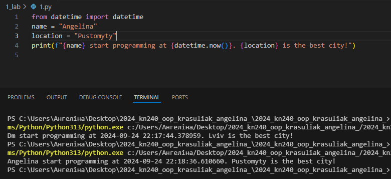
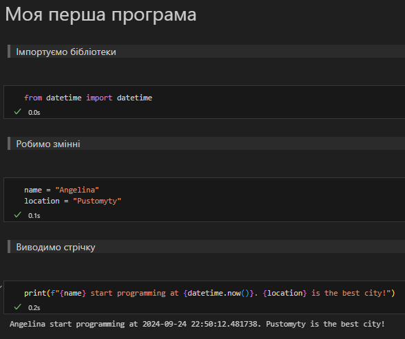
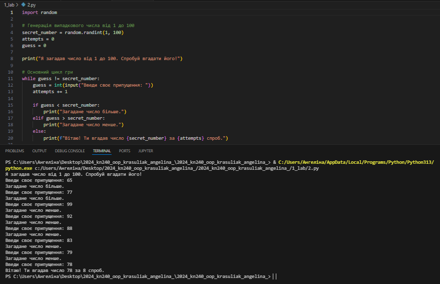

# Звіт до роботи 1

### Тема: _Вступ. Налаштування середовища розробки та робота з Git_

### Мета роботи: _встановити необхідні програми,налаштувати локальне середовище розробки, створити власний репозиторій, попрацювати з форматуванням markdown та оформити звіт_
---
### Виконання роботи
* Результати виконання завдань:
    1. Встановили Python та Visual Studio Code;
    2. Створили власний репозиторі, посилання на нього [<<<тиць>>>](https://github.com/Angelina2031Krasuliak/2024_kn240_oop_krasuliak_angelina_);
    3. Створили початкову сторінку з допомогою ChatGPT;
    4. Навчилися працювати з Markdown;
    5. Доналаштували локальне середовище, встановили плагіни та пристуваємо до першої програми;

* Створили [Python файл](1.py), вставили код програми та запустили її. Результат виконання програми показано на скріншоті нижче:

    
* Продовжуємо роботу та виконувати програму у [Пайтон Ноутбуці](1.ipynb). Результат виконання представлений на скріншоті:

     
* Результати виконання індувідуального завдання:
запитала у ChatGPT яку б першу програму він написав, та чи б міг АІ пояснити її. Код програми від ChatGPT [тут](2.py) та пояснення далі нижче:
---
# Перша програма "Вгадай число"

## Пояснення коду:

1. import random - імпортує модуль для генерації випадкових чисел.
2. random.randint(1, 100) - генерує випадкове число в межах від 1 до 100.
3. Цикл while - продовжується, поки користувач не вгадає число:
    * Користувач вводить число, і програма підказує, чи потрібно вгадувати більше чи менше.
4. Коли число вгадано, програма вітає користувача та виводить кількість спроб.
---

## Як запустити гру:

1. Збережи код у файлі, наприклад guess_the_number.py.
2. Запусти програму через термінал або командний рядок, як показано раніше.
---

Ця гра не тільки цікава, але й дає можливість потренуватися в роботі з умовами та циклами! 

## Результат виконання:

---
### Висновок:

- :question: Що зроблено в роботі: написала першу програму та навчилась її запускати
- :question: Чи досягнуто мети роботи: мета роботи досягнута
- :question: Які нові знання отримано: ознайомисася з Jupiter та Python
- :question: Чи вдалось відповісти на всі питання задані в ході роботи: так, вдалося
- :question: Чи вдалося виконати всі завдання: вдалося виконати всі завдання
- :question: Чи виникли складності у виконанні завдання: з установкою Python, не було вказано правильного шляху 🙄
- :question: Чи подобається такий формат здачі роботи (Feedback): так, такий формат мені подобається
- :question: Побажання для покращення (Suggestions): немає

---